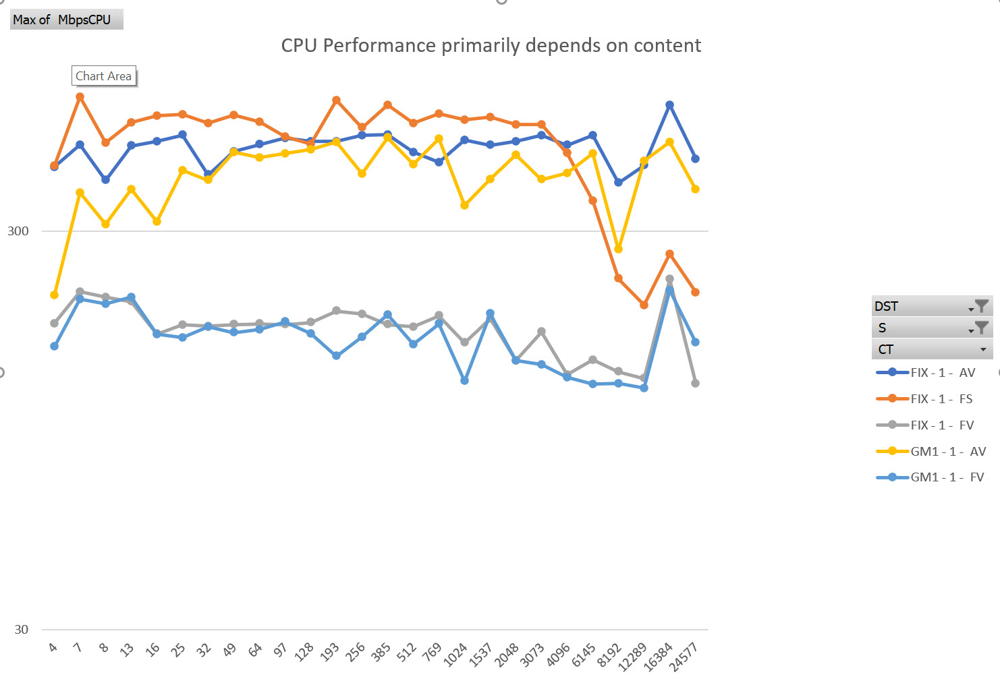
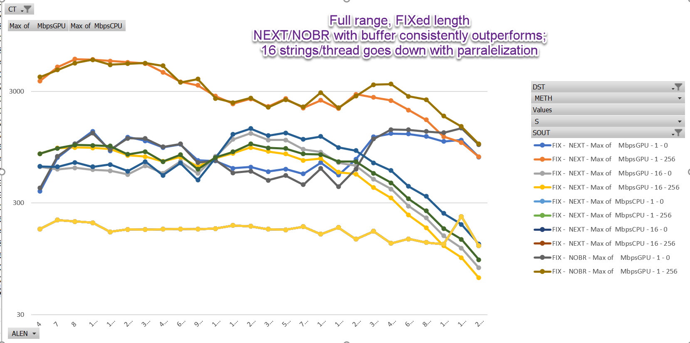
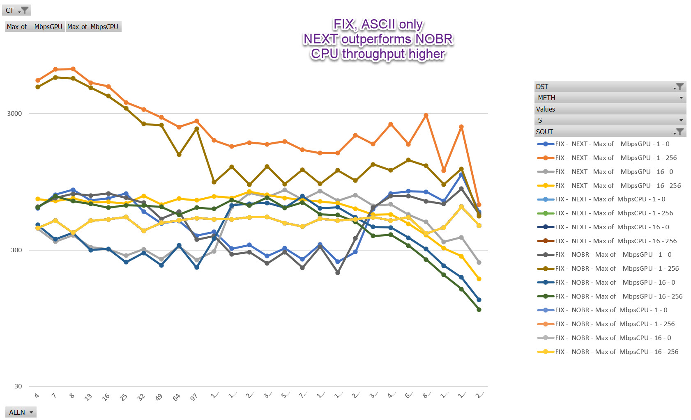
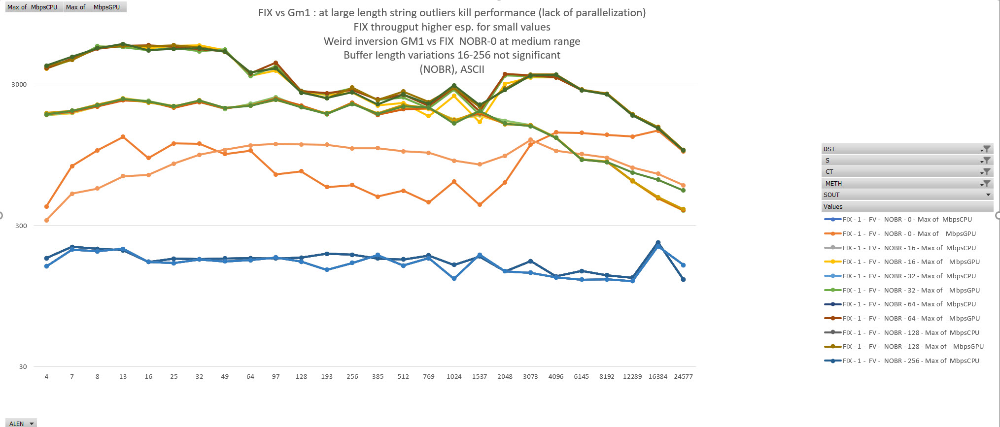
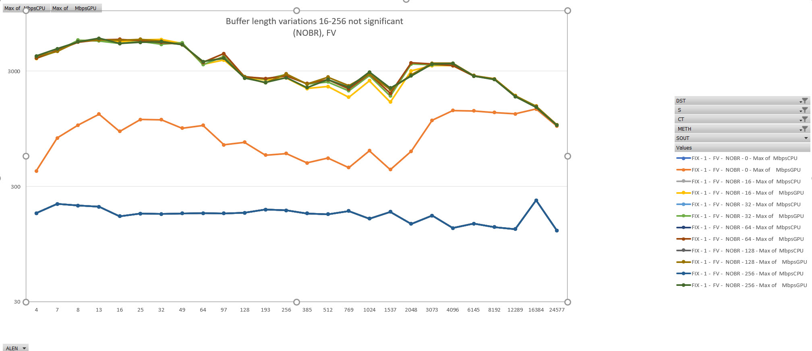

# cuda_conv_example
UTF-8 to UTC32 conversion with cuda


# this is a small example project for first steps with CUDA.


# introduction
We use UTF-8 conversion to UChar32 as it is not  completely SIMD, but leads to warp-divergence on non-trivial input.

The basic question was whether one is able demonstrate superior performance
of a BRANCH-free implementation of U8_NEXT to beat the default branch based U8_NEXT macro of the ICU.
(in some circumstances).

# summary

Ignoring host-device transfer code, speedups of more than factor 20 can be obtained for a 12MB conversion
of full uc content esp. for shorter strings compared to a CPU based single threaded conversion.

The respective implementation in general outperforms the CPU implementation over the range also for other content
(ASCII only), Content with some very long strings. But with less dominance

Using a small output buffer in the stack and writing output in a tight loop significantly enhances throughput.

# details

conversion of a utf-8 encoded arrow style array
(data memory chunk + offsets array) into UCS32 is compared.

Comparison w.r.t. error handling follows the (full) U8_NEXT macros of ICU semantics (not U8_NEXT_UNSAFE),
1. surrogate pairs,
2. non-minimal encodings,
3. illegal ranges

Also the exact "how many bytes to gobble up" semantics are retained/recreated.

are all flagged (flawed = true) and replaced by the Unicode Replacement character during conversion

for ~12MB of data,
Comparing a single thread conversion of a (randomise set of 4,3,2,1 byte sequences  + error sequences)
yields a speedup of 20-5 depending on avg length of strings ignoring the recombination work.


Using a stack buffer for output significantly enhances performance.

UTF conversion is interesting as with the naive macros warp divergence cannot be avoided.
(branch prediction significantly also shows drastic variations in on CPU performance for pure ascii/identical strings)

TODO: implemente the recombination parts in

## plain CPU conversion
CPU conversion runs linear across the buffer.
As expected, all-ASCII or same-input leads to significant speedup due to better CPU branch prediction.
Note that the 12MB considered may completely fit into L3 caches of the CPU, thus full latency limits may not be seen.

Obviously CPU conversion may also be parallelized across CPU threads, which is not done here.

CPU performance varies wiht content



## GPU conversion

Conversion is a three phase process:

1. Compute the target lengths of strings (+ compute the results into a target array with gaps)
2. Compute the exact offsets from the length ( offset[i] = sum(k=[0, i]) len[i] ); "thrust::scan_inclusive"
3. Move the strings into the target array at the right positions.

Steps 2 and 3 coalesce the results into a single gap-free memory area and the time is listed as T.

GPU : GPU processing into buffer with gaps; Coalescing via std::thrust & memcpy on the host
GP2 : GPU processing to compute only offses; scan_inclusive() Coalescing via

<GPU|GPU2>
_
<StringsPerThread> : wheter each thread processes exactly one or more (16) strings
_
<Algorithm> :  U8_NEXT  default ICU macros
               U8_NOBR  non-branching rewrite (at cost of mroe frequent memory accesses & more processing)
_
<input buffer> : stack input buffer, not in use
_
<output buffer> : data is produced in an output buffer which is then written in one loop, note that his may lead to branch divergence if Len > buffer len

Column| Explanation
----|-----
MbpsGPU | bytes per second, GPU  (kernel and coalescing, excluding malloc and memcpy device <-> host)
MbpsCPU | bytes per second, CPU  (excluding malloc)
FAKT | MbpsGPU/MbpsCPU
T_PROC | procssing time (ms) 1st kernel
T_COAL | procssing time (ms) Coalescing
T_CPU | procssing time (ms) CPU
AV | (A)scii / (F)ull ranges + (V)ariable / (S)same in every string
DST |   String length distribution (FIX) (PS1): poisson, (GM1) gamma 1
ALEN | Avg Len
NRSTRING | Nr STrings
MB | megabytes
MEAN | Mean length
STDDEF | Std deviation length
MAXL | MAximum length
THRDS | nr of GPU treads
GRID*BLK | GRid * block


```
                   NAME, S, METH,SOUT,   MbpsGPU, MbpsCPU, FAKT,T_PROC,T_COAL, T_CPU,A,DST, ALEN,NRSTRING,   MB,  MEAN,  STDDEF,  MAXL, THRDS,GRID* BLK
GPU_001_U8_NOBR_000_256,01, NOBR, 256,    510.41,  378.21,  1.3,  8.32, 16.17, 33.05,A,FIX,  128, 102400,    12,   128,    0.04,   128,102400,  3200* 32
GPU_001_U8_NEXT_000_000,01, NEXT, 000,    362.00,  378.21,  1.0, 18.95, 15.58, 33.05,A,FIX,  128, 102400,    12,   128,    0.04,   128,102400,  3200* 32
GPU_001_U8_NEXT_000_256,01, NEXT, 256,    726.01,  378.21,  1.9,  4.47, 12.74, 33.05,A,FIX,  128, 102400,    12,   128,    0.04,   128,102400,  3200* 32
GPU_001_U8_NOBR_000_000,01, NOBR, 000,    357.67,  378.21,  0.9, 21.09, 13.86, 33.05,A,FIX,  128, 102400,    12,   128,    0.04,   128,102400,  3200* 32
GPU_001_U8_NOBR_000_256,01, NOBR, 256,    582.66,  378.21,  1.5,  8.24, 13.22, 33.05,A,FIX,  128, 102400,    12,   128,    0.04,   128,102400,  3200* 32
GPU_016_U8_NEXT_000_000,16, NEXT, 000,    276.56,  378.21,  0.7, 30.95, 14.24, 33.05,A,FIX,  128, 102400,    12,   128,    0.04,   128,  6400,   200* 32
GPU_016_U8_NEXT_000_256,16, NEXT, 256,    695.05,  378.21,  1.8,  4.58, 13.41, 33.05,A,FIX,  128, 102400,    12,   128,    0.04,   128,  6400,   200* 32
GPU_016_U8_NOBR_000_000,16, NOBR, 000,    342.85,  378.21,  0.9, 22.94, 13.52, 33.05,A,FIX,  128, 102400,    12,   128,    0.04,   128,  6400,   200* 32
GPU_016_U8_NOBR_000_256,16, NOBR, 256,    594.93,  378.21,  1.6,  8.33, 12.68, 33.05,A,FIX,  128, 102400,    12,   128,    0.04,   128,  6400,   200* 32
GP2_001_U8_NOBR_000_016,01, NOBR, 016,    998.43,  378.21,  2.6,  4.62,  7.90, 33.05,A,FIX,  128, 102400,    12,   128,    0.04,   128,102400,  3200* 32
GP2_001_U8_NOBR_000_032,01, NOBR, 032,    992.68,  378.21,  2.6,  4.60,  7.99, 33.05,A,FIX,  128, 102400,    12,   128,    0.04,   128,102400,  3200* 32
GP2_001_U8_NOBR_000_064,01, NOBR, 064,    985.48,  378.21,  2.6,  4.64,  8.05, 33.05,A,FIX,  128, 102400,    12,   128,    0.04,   128,102400,  3200* 32
GP2_001_U8_NEXT_000_256,01, NEXT, 256,   2028.00,  378.21,  5.4,  1.66,  4.51, 33.05,A,FIX,  128, 102400,    12,   128,    0.04,   128,102400,  3200* 32
GP2_001_U8_NEXT_000_128,01, NEXT, 128,   1998.62,  378.21,  5.3,  1.65,  4.61, 33.05,A,FIX,  128, 102400,    12,   128,    0.04,   128,102400,  3200* 32
GP2_001_U8_NOBR_000_256,01, NOBR, 256,    958.03,  378.21,  2.5,  4.68,  8.37, 33.05,A,FIX,  128, 102400,    12,   128,    0.04,   128,102400,  3200* 32
GP2_001_U8_NOBR_000_128,01, NOBR, 128,    963.63,  378.21,  2.5,  4.62,  8.36, 33.05,A,FIX,  128, 102400,    12,   128,    0.04,   128,102400,  3200* 32
```
# building

install Cuda (11.7.0)

install next to the cuda-samples directory

./cuda_samples
./cuda_conv_example

Set environment variables to point to CUDA samples headers

```
CUDA_PATH=C:\Program Files\NVIDIA GPU Computing Toolkit\CUDA\v11.7
CUDA_PATH_V11_7=C:\Program Files\NVIDIA GPU Computing Toolkit\CUDA\v11.7
CUDA_SAMPLES_DIR=c:\progenv/cuda/cuda-samples
```

Open .sln in Visual Studio (2022)
Compile as Release X64 build.
dir bin\win64\Release\cuda_utf8_uchar32.exe

#

# Data sets
The datasets are 12MB

The default compile results procudes a file in ..\..\..\output\results.csv
containing a run across:
AVG_
cmdline options


# some timings

- Processor	Intel(R) Core(TM) i9-9880H CPU @ 2.30GHz, 2304 Mhz, 8 Core(s), 16 - Logical Processor(s)
- NVIDIA Quadro T2000


AVG_LEN|NRBLOCKS | var length   | non-Ascii |  time CPU | time GPU1 | time GPU StckBuffer | coalese   |NrStrings
-------:|----------:|-----------|-------|----------|-----------:|------------------:|---------:|---------:
4*64    | 32        |   no      |  yes  |   50ms   |  10.0ms    |  2.9ms            |  6.2ms   |
64      | 32        |   no      |  yes  |   50ms   |  4.6ms     |  2.6ms            |  6.6ms   |204800
4*64      | 32        |   yes     |  same,yes  |   11ms   |  8.4ms     |  2.3ms            |  6.6ms   |204800
4*64      | 32        |   yes      |  same,no  |   21ms   |  30.0ms     |  7.2ms            |  6.6ms   |204800
4*64      | 32        |   no      |  yes  |  21ms   |  30.0ms     |  7.2ms            |  6.6ms   |204800
4*64      | 32        |   no      |  same,yes  |  18ms   |  14.0ms     |  4.8ms            |  6.6ms   |204800 (reverse ix)
4*64      | 32        |   no      |  same,yes  |  18ms   |  14.0ms     |  3.5ms            |  6.6ms   |204800 (normal ix)


Note: Timing exclude Device to host memcpy and allocations!

Note: The CPU code is single threaded.


## Results

Full content: No branch shows superiour performance for FIX ed length


ASCII content, U8_NEXT outperforms NO-Branch implementation at longer length




Varying length performace:




Buffer length ( FULLBR ) ; Note 0 does not use GP2
